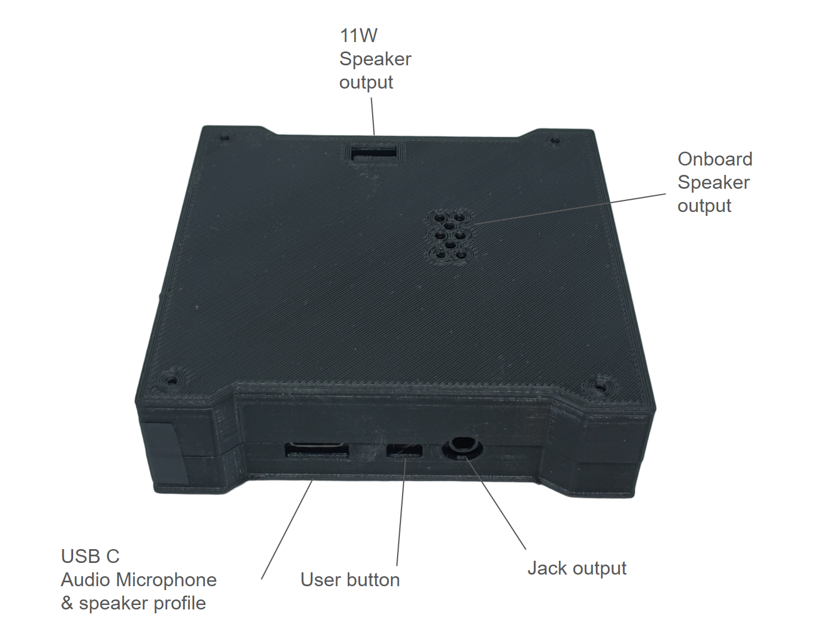
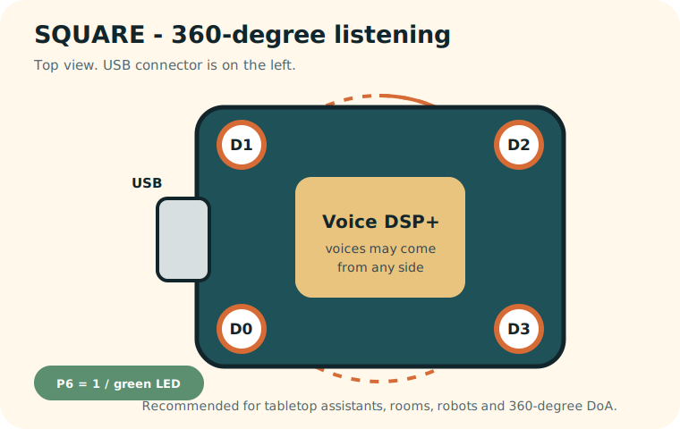
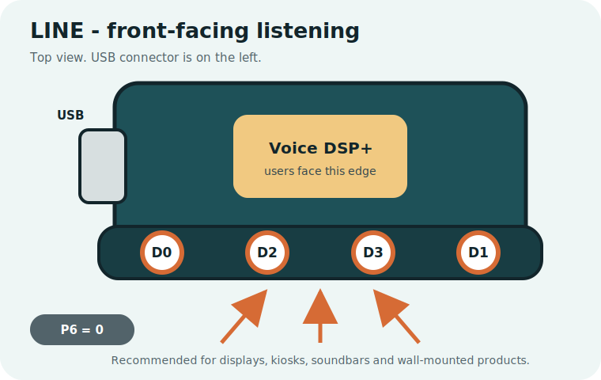

# RASPIAUDIO Voice DSP+

Voice DSP+ is a four-microphone voice interface with built-in audio processing,
speaker and stereo headphone output, direction-of-arrival LEDs and a user
button. It can work as a simple USB sound card or as a Raspberry Pi audio HAT.

[Product page](https://raspiaudio.com/product/aimic/) | [Browser firmware updater](https://raspiaudio.com/AIMIC/webflasher/)

[](https://raspiaudio.com/product/aimic/)

## Start Here: USB

USB is the recommended first experience. The board appears as a standard
48 kHz sound card with two processed microphone channels and stereo playback.

1. [Choose the LINE or SQUARE microphone layout](docs/hardware.md#choosing-line-or-square),
   then install the four-microphone module while power is off.
2. Connect Voice DSP+ to the computer with USB.
3. Select `PI AI MIC Assistant Auto` as microphone and speaker. This is the
   current legacy USB name of the validated Voice DSP+ firmware.
4. To update the firmware, open the
   [Voice DSP+ browser updater](https://raspiaudio.com/AIMIC/webflasher/).

No driver is required on current Windows, macOS or Linux systems. The firmware
automatically detects the microphone geometry at cold boot.

| SQUARE: voices can come from all around | LINE: users are in front |
| --- | --- |
| [](docs/hardware.md#square-layout) | [](docs/hardware.md#line-layout) |

[USB firmware and technical details](firmware/usb-48k-auto/README.md)

## Raspberry Pi

Use Raspberry Pi mode when you want I2S audio and XVF3800 control from Linux.
The default product mode is 16 kHz voice processing with automatic microphone
geometry detection.

```bash
git clone https://github.com/RASPIAUDIO/Voice-DSP-Plus.git
cd Voice-DSP-Plus
sudo bash raspberrypi/install.sh
sudo reboot
```

Quick test after reboot:

```bash
speaker-test -D pulse -c 2 -r 16000 -F S32_LE -t sine -f 1000 -l 1
arecord -D pulse -f S32_LE -r 16000 -c 2 -d 10 ~/voice-dsp-plus.wav
aplay -D pulse ~/voice-dsp-plus.wav
```

[Raspberry Pi firmware details](firmware/raspberry-pi-16k-auto/README.md)

## Main Features

- Four digital microphones in LINE or SQUARE geometry.
- Automatic geometry detection at cold boot.
- Beamforming, acoustic echo cancellation, noise processing and AGC.
- Two processed microphone channels.
- Mono differential onboard speaker output.
- Automatic stereo headphone routing and speaker mute when a jack is inserted.
- Direction of arrival on an optional 24-pixel WS2812B ring.
- USB hold-to-dictate shortcut from the onboard button.

## Documentation

- [Hardware and connectors](docs/hardware.md)
- [Pinout](docs/pinout.md)
- [Build from source](docs/building-firmware.md)
- [Advanced firmware](advanced/README.md)

The repository intentionally exposes only two normal product choices: USB
48 kHz AUTO and Raspberry Pi 16 kHz AUTO. Diagnostic and specialist images are
kept under `advanced/` so the normal setup remains simple.
