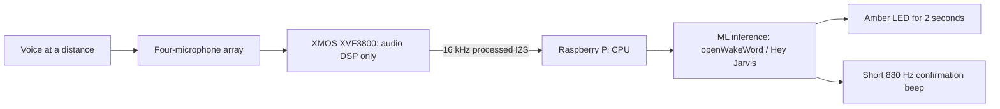

# Application Note: Far-Field Wake-Word Demo

This application note turns Voice DSP+ and a Raspberry Pi into a standalone
far-field wake-word demonstrator. No cloud service is required.

> [!IMPORTANT]
> The wake-word model runs on the **Raspberry Pi CPU**, not on the XMOS
> XVF3800. The XMOS firmware performs the far-field audio front end
> (microphone capture, beamforming and voice processing), then sends a
> processed 16 kHz stream to the Raspberry Pi over I2S. The Raspberry Pi runs
> `pyopen-wakeword` and the pretrained `hey_jarvis` machine-learning model.

| Component | Role in this demo |
| --- | --- |
| XMOS XVF3800 on Voice DSP+ | Audio DSP only: four-microphone acquisition, beamforming and voice processing |
| Raspberry Pi | Wake-word inference: Python, `pyopen-wakeword` and the `hey_jarvis` model |
| Cloud | Not used |



## Validated Setup

- Voice DSP+ in Raspberry Pi 16 kHz AUTO mode.
- LINE or SQUARE microphone geometry selected automatically at cold boot.
- `pyopen-wakeword==1.1.0` with the pretrained `hey_jarvis` model.
- Detection threshold `0.35`, selected to reduce sensitivity slightly after the
  initial far-field validation.
- Detection feedback runs asynchronously and does not stop microphone capture.
- The speaker sink temporarily rises to 50% for the 0.6-second beep, then
  returns to its previous volume.
- The bicolor LED turns amber immediately for two seconds, then restores the
  normal red=jack and green=SQUARE indication.

The XVF3800 front-end profile used by the demo is:

| Parameter | Value |
| --- | ---: |
| `PP_MIN_NS` | `0.10` |
| `PP_MIN_NN` | `0.51` |
| `PP_AGCGAIN` | `10` initial seed |
| `AUDIO_MGR_MIC_GAIN` | `10` |
| `PP_LIMITPLIMIT` | `0.47` |

AGC and the limiter remain enabled. `PP_AGCGAIN` is adaptive, so its live
readback is expected to move after startup.

## Install

First complete the normal [Raspberry Pi installation](../../README.md#raspberry-pi)
and reboot. Then run:

```bash
cd ~/Voice-DSP-Plus/raspberrypi/wakeword
sudo apt update
sudo apt install -y python3-venv alsa-utils

mkdir -p ~/voice-dsp-hey-jarvis ~/.config/systemd/user
python3 -m venv ~/voice-dsp-hey-jarvis/.venv
~/voice-dsp-hey-jarvis/.venv/bin/pip install pyopen-wakeword==1.1.0

cp hey_jarvis_detector.py apply_xmos_profile.sh ~/voice-dsp-hey-jarvis/
chmod +x ~/voice-dsp-hey-jarvis/apply_xmos_profile.sh
cp voice-dsp-hey-jarvis.service ~/.config/systemd/user/

systemctl --user disable --now voice-dsp-wakeword.service 2>/dev/null || true
systemctl --user daemon-reload
systemctl --user enable --now voice-dsp-hey-jarvis.service
```

Only one process can own the direct ALSA capture device. The command above
disables the older experimental detector before starting this demo.

## Run The Demo

Follow the detector log:

```bash
journalctl --user-unit=voice-dsp-hey-jarvis.service -f -o cat
```

Say **Hey Jarvis** and pause. A successful detection produces an event like:

```text
DETECTED model=hey_jarvis score=0.982 rms=0.0843 time=2026-07-26T17:52:17
```

The LED must change immediately and the confirmation beep must follow without
the previous DAC startup delay. Disable both feedback outputs during acoustic
measurements by adding `--no-feedback` to the detector command.

## Validation Checkpoint

The reference setup was validated with a Windows Conexant speaker approximately
three metres from the microphone array. Five non-overlapping playback runs gave
20 detections for 20 recorded utterances. A separate five-minute quiet-room
check produced no false detection; the highest observed score was `0.008`.

A full Raspberry Pi reboot was also tested. The SPI firmware boot service,
processed microphone path, detector, LED feedback and confirmation beep all
returned automatically.

These results demonstrate the far-field application but are not a production
acceptance test. A product qualification campaign should add multiple speakers,
distances, angles, noise types and multi-hour false-activation measurements.

## Sources And Tuning

The complete scripts, systemd unit, Windows test tools and tuning notes are in
[`raspberrypi/wakeword/`](../../raspberrypi/wakeword/README.md).
